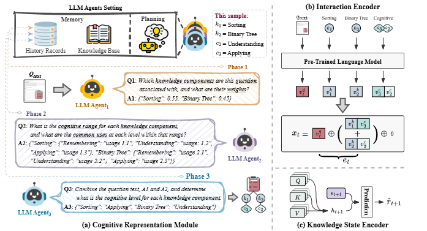

# CEKT

## CEKT: A Cognitive-Enhanced Knowledge Tracing with LLM Agents

## Dataset
**BePKT**: [https://drive.google.com/drive/folders/1U5u0rw3GT-n71D09DZqkhP1Fb5tlDcTb](https://drive.google.com/drive/folders/1U5u0rw3GT-n71D09DZqkhP1Fb5tlDcTb)

**CodeWorkout (Code-S, Code-F)**: [https://pslcdatashop.web.cmu.edu/Files?datasetId=3458](https://pslcdatashop.web.cmu.edu/Files?datasetId=3458)

**LeetCode**: [https://leetcode.com/](https://leetcode.com/)

